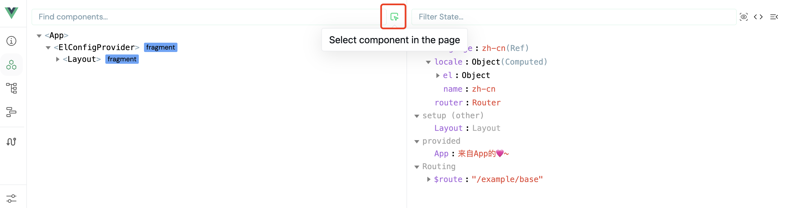

# FAQ

## The Component Does Not Render Correctly

If the component is not displayed, first check whether the DOM node is mounted correctly. If the node is mounted but not visible, the usual cause is that the component library's CSS styles were not imported correctly.

## The Component Cannot Be Inspected in Vue Devtools

This is a known limitation and there is no perfect solution yet. As a workaround, use the component picker in Vue Devtools, shown below, to select the target component for inspection.



## Components Are Not Destroyed After Route Navigation

If you want to destroy all dialogs after route navigation, use the `useDestroyAllOnRouteChange` hook. It listens for route changes and destroys all dialogs.

Installation:

```shell
npm i @vue-cmd/hooks
```

Usage:

```ts
import { useDestroyAllOnRouteChange } from "@vue-cmd/hooks";
// Call it as early as possible, for example in App.vue
const stop = useDestroyAllOnRouteChange();
// stop();
```

## ElConfigProvider Injection Configuration Fails in Older Element Plus Versions

The latest Element Plus versions do not have this issue. For older versions, you can manually inject the configuration again.

Extract a configuration injection component, then use it where you previously injected the config:

```tsx
import { ElConfigProvider } from "element-plus";
import { computed, defineComponent, getCurrentInstance } from "vue";
import zh from "element-plus/es/locale/lang/zh-cn";
import en from "element-plus/lib/locale/lang/en";

export default defineComponent({
  setup(_, { slots }) {
    return () => <ElConfigProvider locale={zh}>{slots}</ElConfigProvider>;
  },
});
```

Then wrap command components with this component, so we need a small wrapper:

```tsx
import ElConfigProvider from "./ElConfigProvider";

import {
  useDrawer as useDrawerRaw,
  useDialog as useDialogRaw,
} from "@vue-cmd/element-plus";

export function useDrawer(config = {}) {
  const drawer = useDrawerRaw(config);
  return (VNode, config) => {
    drawer(<ElConfigProvider>{VNode}</ElConfigProvider>, config);
  };
}

export function useDialog(config) {
  const drawer = useDialogRaw(config);
  return (VNode, config) => {
    drawer(<ElConfigProvider>{VNode}</ElConfigProvider>, config);
  };
}
```

Usage does not change; only the import path changes:

```tsx
import { useDrawer } from "@/components/VueCmd";

const drawer = useDrawer();

drawer(<div>hello</div>);
```
