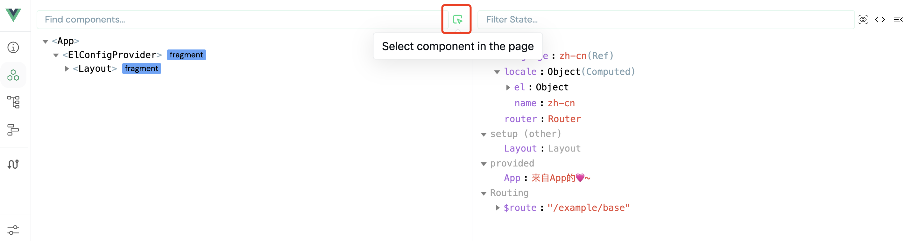

# 常见问题

## 组件未正常渲染

如果组件未显示，请首先检查DOM节点是否正确挂载。若节点已挂载但未显示，通常是由于组件库的CSS样式未正确导入所致。

## 组件无法被Vue开发工具审查

这是当前已知限制，暂无完美的解决方案。不过您可以使用以下替代方法：在Vue开发者工具中使用组件选择器（见下图）选择目标组件进行审查。



## 路由跳转后组件未销毁

如果你希望路由跳转后销毁所有弹窗,请使用`useDestroyAllOnRouteChange`hooks.它的作用就是监听路由变化,然后销毁所有弹窗。

安装:
```shell
  npm i @vue-cmd/hooks
```

使用:
```ts
import { useDestroyAllOnRouteChange } from '@vue-cmd/hooks';
// 尽量提前调用,比如在App.vue中调用
const stop = useDestroyAllOnRouteChange();
// stop();
```
